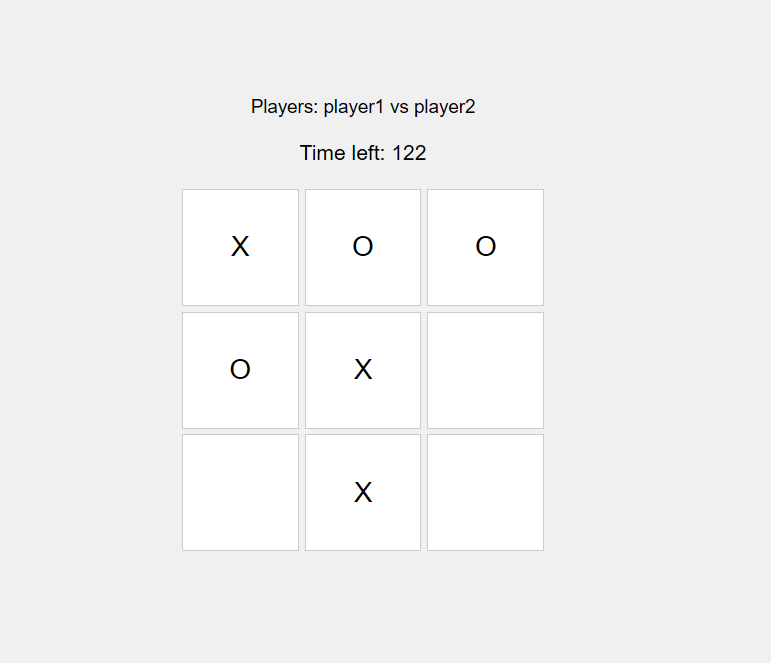

# Tic-Tac-Toe_multiplayer

This is a multiplayer Tic-Tac-Toe game built using socket.io(JavaScript library that enables real-time, bidirectional, and event-based communication between a client and a server.) and node.js (JavaScript library that enables real-time, bidirectional, and event-based communication between a client and a server.) .

## Features

- Real-time multiplayer game
- Timer for each move
- Displays winner in a modal

## Screenshot

## Installation

1. Clone the repository
2. Install dependencies with `npm install`
3. Run the server with `node server.js`
4. Open your browser and go to `http://localhost:3000`

## Usage

- Enter your username and join the game
- Make your move and the timer will switch to the other player
- The game ends when there's a winner or a draw
